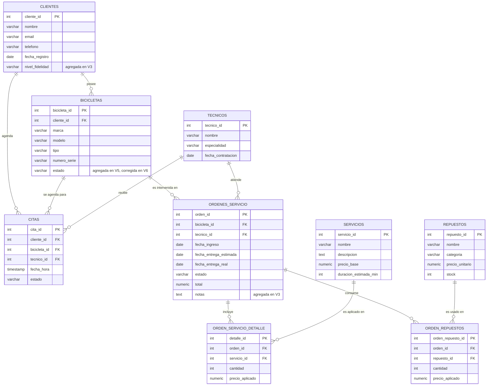

# Dominio de negocio — Taller de reparación de bicicletas "Rueda Libre"

## Descripción

"Rueda Libre" es un taller mecánico especializado en mantenimiento y reparación de
bicicletas. Cada **cliente** puede tener registradas una o varias **bicicletas**, y cada vez
que trae una a revisión se abre una **orden de servicio** asignada a un **técnico**. Una
orden agrupa uno o más **servicios** de un catálogo fijo (ajuste de frenos, cambio de
cadena, verdadeo de rueda, etc.) y, opcionalmente, **repuestos** del inventario del taller
(pastillas de freno, cámaras, cadenas...) que se consumen en esa reparación. Además, los
clientes pueden agendar una **cita** previa para asegurar turno antes de dejar la bicicleta.

El modelo resuelve el mismo tipo de pregunta operativa que un taller real necesita
responder todos los días: qué bicicletas están en reparación, cuánto cuesta cada orden
(mano de obra + repuestos), qué técnico atendió cada trabajo, y qué repuestos hay que
reponer en inventario.

## Por qué este dominio

Es un dominio con jerarquía real de al menos dos niveles (`clientes → bicicletas → órdenes
de servicio → detalle de servicios / repuestos`), volumen de datos naturalmente pequeño
(un taller mediano no supera unos pocos miles de órdenes al año) y reglas de negocio con
peso propio (cálculo de totales, control de stock, estados de una orden) que justifican
tanto migraciones evolutivas como una función repetible — sin depender de Parch & Posey ni
de otro proyecto visto en clase.

## Modelo transaccional

- **clientes** — dueños de las bicicletas.
- **bicicletas** — pertenecen a un cliente (1 cliente → N bicicletas).
- **tecnicos** — mecánicos del taller que atienden órdenes.
- **servicios** — catálogo de servicios ofrecidos (precio base, duración estimada).
- **repuestos** — inventario de piezas (precio unitario, stock disponible).
- **ordenes_servicio** — una intervención sobre una bicicleta, asignada a un técnico.
- **orden_servicio_detalle** — servicios aplicados dentro de una orden (N a N entre
  `ordenes_servicio` y `servicios`, con precio congelado al momento de la orden).
- **orden_repuestos** — repuestos consumidos dentro de una orden (N a N entre
  `ordenes_servicio` y `repuestos`, con precio congelado y cantidad).
- **citas** — turno agendado por un cliente para una bicicleta, antes de convertirse en
  orden de servicio (agregada en una migración evolutiva posterior al baseline).

## Diagrama entidad-relación

## Volumen de datos

Datos sintéticos generados en el baseline: ~40 clientes, ~60 bicicletas, 6 técnicos, 12
servicios de catálogo, 20 repuestos, ~150 órdenes de servicio con su detalle. Muy por debajo
del tier gratuito de Neon (0.5 GB).
